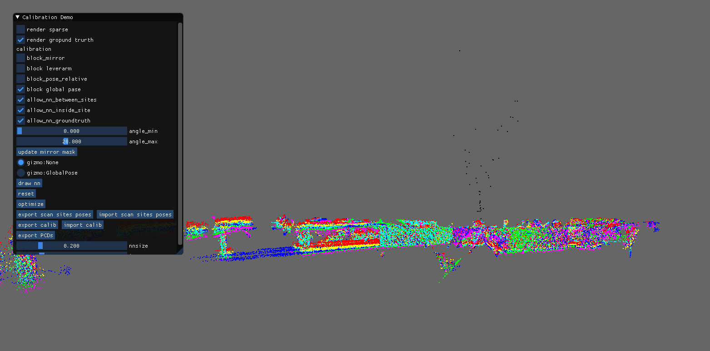
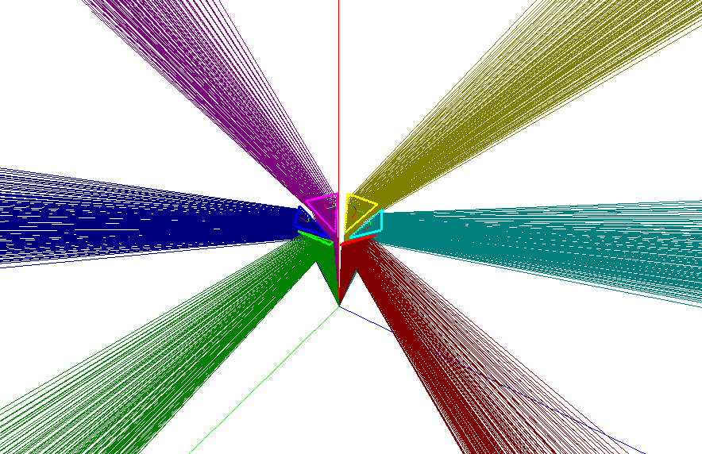

# Design

ToDo

# Catoprtric calibration tool

## Compilation

Install dependencies:
```
sudo apt-get install libtbb-dev libceres-dev libpcl-dev libglfw3-dev libglm-dev
```
```
mkdir -p calibration_tool/build
cd calibration_tool/build
cmake .. -DCMAKE_BUILD_TYPE=Release
make -j6
```

Sample execution:
```
./calibration_gui  --dataset ../../sample_data/file_list_A.txt --mirror_config ../../sample_data/test_lustro_hex_v2.ply
```

# calibration_gui
## Input parameters
The calibration suite to calibrate. It takes parametes:

`dataset` - list of calibration datasets.  Files listed here should contain list of CSV from LivoxViewer and angles, sample file is here:
```
# angle livox_csv
0 garazA/a0.csv
10 garazA/a10.csv
20 garazA/a20.csv
30 garazA/a30.csv
40 garazA/a40.csv
50 garazA/a50.csv
60 garazA/a60.csv
```
If multiple scans site are added, User can update its poses with gizmos. Optimization can be done separetly on every site, or
simultaneously using nearest neighborhood between multiple scans.

`ground_truth` - ground truth PCD (PCL point cloud), this file allows to register scans to ground truth simultaneously optimize parameters

`mirror_config` - a simplified PLY with mirror initial config.

## Usage - sinlge scan
```
./calibration_gui  --dataset ../../sample_data/file_list_A.txt --mirror_config ../../sample_data/test_lustro_hex_v2.ply
```
After loading, please click "Optimize". This sample optimize in 20 iterations. 


## Usage - multiple scan
```
./calibration_gui  --dataset ../../sample_data/file_list_A.txt ../../sample_data/file_list_B.txt --mirror_config ../../sample_data/test_lustro_hex_v2.ply
```

## Controls 

- `render_sparse` - allows to render a sparses pointcloud (use that when manipulate pointclouds)
- `render ground truth` - renders ground turth (if loaded)
- `block mirrors` - blocks optimization of mirror parameters
- `block leverarm` - blocks optimization of laser scanner on turntable
- `block pose relative` - blocks optimization between multiple sites (only if multiple sites when loaded)
- `block global pose` - blocks optimization between model and ground truth (only ground truth when loaded)
- `allow_nn_between_sites` - searches for correspondeces between multiple sites
- `allow_nn_indside_site` - searches for correspondeces iner one site
- `allow_nn_groundtrurth` - searches for correspondeces between scan sites and ground truth
- `draw NN` - draws corespondeces
- `reset` - resets all optimized parameters
- `export scan sites poses` - exports scan site SE3 poses to ini file 
- `import scan sites poses` - imports scan site SE3 poses from ini file 
- `export calib` - exports parameters of mirrors
- `import calib` - imports parameters of mirrors
- `export PCDs` - save current model and ground truth.

# simulation_gui
Simple program to check field of view with sample config and simulated Livox Mid-40
```
./simulate_gui --mirror_config ../../sample_data/test_lustro_hex_v2.ply
```



# Road map
- ROS1/ROS2 node that will consume calibration 
- Support for non-triangular mirrors


# Datasets to download
```
cd sample_data/
wget https://storage.googleapis.com/dataset_sensors_pub/mid-40-garageA.tar.xz
tar -xf mid-40-garageA.tar.xz
```
or run `download.sh`